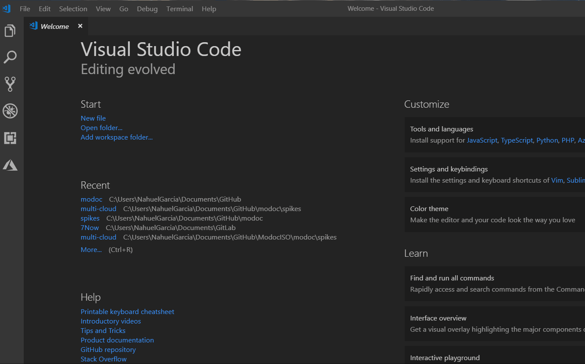

# ESLint

## Installation

For **Visual Studio Code** just download the ESLint extension as the following:

**Note:** make sure that the ESLint dependencies are installed, use `npm install` instead.

## Configurations

The linter configurations are set using the recommended rules from [eslint](https://eslint.org/docs/rules/), [jest](https://github.com/jest-community/eslint-plugin-jest) and [node](https://github.com/mysticatea/eslint-plugin-node). Additionally, there are some specific rules set and each one of them is set to throw an error:

- **indent:** set to `4`, enforces a consistent indentation style. [more details](https://eslint.org/docs/rules/indent)
- **linebreak-style:** set to `unix`, enforces consistent line endings independent of operating system, VCS, or editor used across your codebase. [more details](https://eslint.org/docs/rules/linebreak-style)
- **quotes:** set to `single`, enforces the consistent use of either backticks, double, or single quotes. [more details](https://eslint.org/docs/rules/quotes)
- **semi:** set to `always`, require or disallow semicolons [more details](https://eslint.org/docs/rules/semi)
