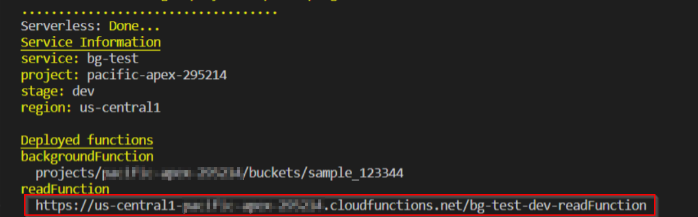

# Sample using GCP Storage


## Table of Contents

* [About the Project](#about-the-project)
  * [Built With](#built-with)
  * [Prerequisites](#prerequisites)
* [Getting Started](#getting-started)
  * [Obtain Google cloud credentials](#obtain-google-cloud-credentials)
  * [Installation](#installation)
* [Usage](#usage)
  * [Deploy Google Cloud function.](#deploy-google-cloud-function)
  * [Run the function](#run-the-function)
  * [Tests](#tests)
  * [Lint](#lint)

## About The Project

This sample uses the @multicloud/sls-gcp library to deploy a cloud function and read/write object in a bucket. Also creates a bucket automatically, which configuration is located in [serverless-google.yml](serverless-google.yml)


### Built With

* [Node js](https://nodejs.org/es/)
* [Serverless](https://serverless.com/)

### Prerequisites

- [Node js](https://nodejs.org/es/) v10 or greater

## Getting Started

To run the sample follow the following steps

### Obtain google cloud credentials

To obtain the google cloud credential, first you need to create your google cloud account. After that follow these simple steps:

1. In the Cloud Console, go to the Create service account key page.

2. Go to the Create Service Account Key page
  From the Service account list, select New service account.
  In the Service account name field, enter a name.
  From the Role list, select Project > Owner.

3. Click Create. A JSON file that contains your key downloads to your computer.

### Installation

1. Navigate to `samples/gcp-storage` .

```sh
cd samples/gcp-storage
```

2. Install serverless

```sh
npm i -g serverless
```

3. Install NPM packages

```sh
npm install
```
4. Add your google credentials to `/gcp-storage/.gcloud/keyfile.json` following the structure detailed below.

```json
{
  "type": "Type of account",
  "project_id": "Project id",
  "private_key_id": "Private key id obtained from google",
  "private_key": "Private key obtained from google",
  "client_email": "client email",
  "client_id": "client ID",
  "auth_uri": "Auth uri",
  "token_uri": "Token uri",
  "auth_provider_x509_cert_url": "Auth provider",
  "client_x509_cert_url": "Client cert url"
}
```

## Usage

### Deploy Google Cloud function.

In order to run the google cloud function. Run the following command

```sh
npm run deploy:google
```

### Run the function.

The function basically, creates a txt file inside a predefined bucket with the following text: `Hello yourName` where yourName is a query parameter. By default it shows `Hello World`

To run and test the response, you should use postman and use the URL given by serverless when you deploy the function.



So, the next step is just create a get request using postman, as the following image shows.


When a file gets created or modified in the bucket, the background function gets triggered


### Tests

All tests can be run in console with the command in the path `samples/gcp-storage`

```sh
npm test
```

### Lint

We configured a linter to verify it to help maintaining code quality,

When running `git commit` or `git push`, husky will execute `npm run lint`. This will lint your code and report any error in your files.

You can fix errors executing `npm run lint` or `npm run lint:fix` by hand.
